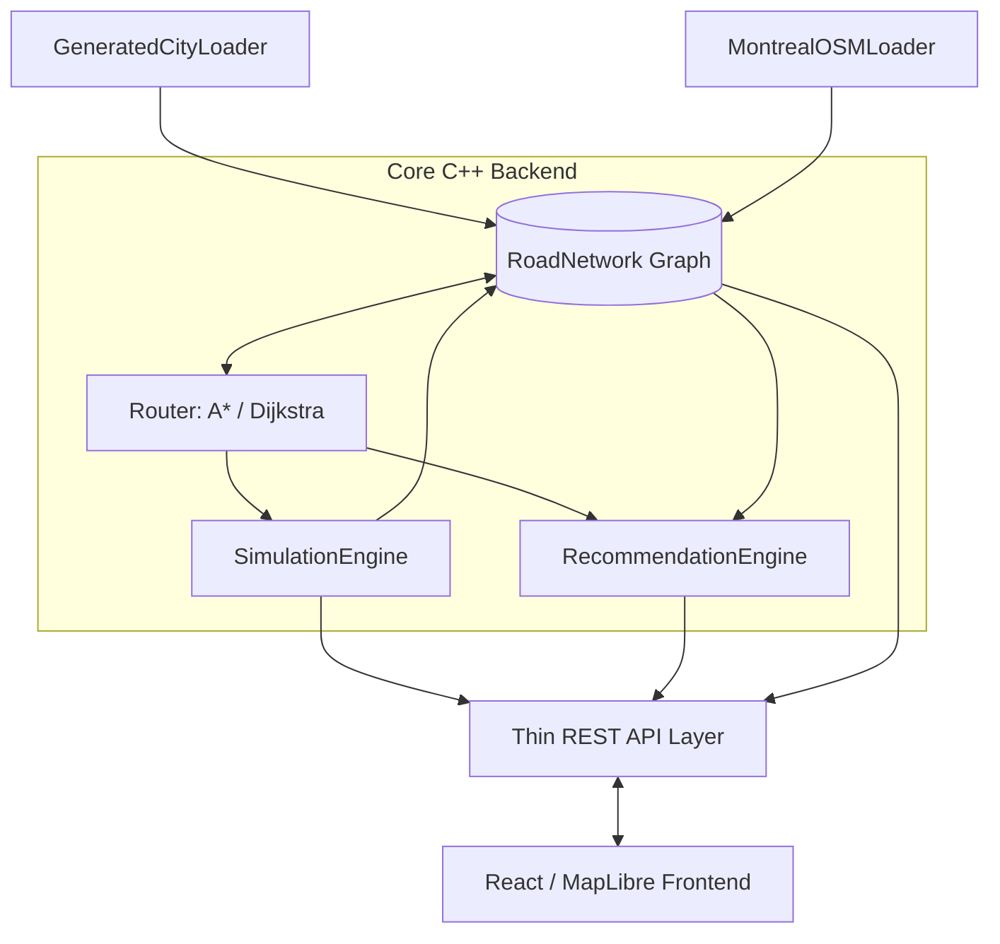

# Smart Mobility Simulator

[](https://isocpp.org/)
[](https://cmake.org/)
[](https://reactjs.org/)
[](<>)
[](https://github.com/TODO-ADD-USERNAME/smart-mobility-simulator/actions)

A cross-platform C++20 smart mobility simulator featuring graph-based routing, multi-agent traffic simulation, personalized route recommendations, and real Montreal road data.

The backend runs a deterministic, high-performance simulation engine that updates thousands of vehicles per second, models emergent congestion, and computes A* shortest-path routing over dynamic edge costs. The system exposes a REST API consumed by a React frontend to visualize city-scale traffic patterns in real-time.

---

## 📸 Visualization

> **TODO:** Insert an animated GIF (`docs/assets/montreal-demo.gif`) demonstrating 500+ vehicles navigating the Montreal grid, showing real-time congestion heatmaps and dynamic rerouting around an active accident.

---

## ⚡ Quick Feature Overview

- _*Dijkstra and A* Pathfinding:_* Extensible routing engine supporting Fastest, Shortest, and Least-Traffic objectives.
- **Deterministic Multi-Agent Simulation:** Vehicles navigate road segments using real physics (velocity × delta-time).
- **Emergent Congestion:** Road occupancy dynamically increases travel-time edge costs.
- **Incident Rerouting:** Live road closures and accidents trigger automatic route re-evaluations.
- **Real OpenStreetMap Integration:** Parses `.osm.pbf` data (Montreal) via `libosmium`, handling one-way streets, varying speed limits, and geographic Haversine distances.
- **Personalized Recommendations:** Multi-objective scoring system to balance travel time, distance, cost, and congestion for user profiles.
- **Cross-Platform:** Builds identically on Linux (GCC) and Windows (MSVC) through CMake and GitHub Actions.

---

## 🎯 Why This Project Exists

I built the Smart Mobility Simulator to deepen my understanding of modern C++ performance, cache locality, and graph algorithms by applying them to a tangible, visual problem domain.

Instead of writing toy functions, this project demonstrates how to build a complete, cleanly decoupled software architecture. It integrates rigorous C++ backend engineering—focusing on value semantics, dense memory layouts, and algorithmic optimization—with a modern web frontend to create a measurable, interactive system.

---

## 🏗 Architecture

The system is decoupled into pure data models, functional graph algorithms, and a thin HTTP API layer.



**Key Architectural Decision:** Both the Generated City grid and the parsed Montreal OSM data are transformed into the exact same `RoadNetwork` abstraction. The routing, traffic, simulation, and recommendation engines do not know the source of the data, allowing identical testability and behavior across simple test grids and massive real-world maps.

---

## 🛠 Tech Stack

| Category         | Technology                             |
| :--------------- | :------------------------------------- |
| **Core**         | C++20                                  |
| **Build System** | CMake, Ninja                           |
| **Routing**      | Custom A* and Dijkstra implementations |
| **OSM Parsing**  | `libosmium`                            |
| **Backend API**  | `cpp-httplib`, `nlohmann/json`         |
| **Frontend**     | React, Vite                            |
| **Maps**         | MapLibre GL JS                         |
| **Testing**      | Catch2, CTest                          |
| **CI / CD**      | GitHub Actions                         |

---

## 🗺 Routing Engine

The core `RoadNetwork` is represented as a directed graph where nodes are intersections and directed edges are drivable road segments.

The `Router` implements both Dijkstra and A* pathfinding. Crucially, the _algorithm_ is decoupled from the _objective_. The objective (Shortest distance, Fastest time, Least traffic) is passed as an enum and dictates how edge costs are computed dynamically during relaxation. For A* on geographic data, the heuristic uses the Haversine formula to guarantee admissibility.

---

## 🏙 Generated City vs. Montreal Mode

**Generated City:**
A deterministic, pure Cartesian coordinate grid. Used for rigorous algorithmic unit testing, predictable simulation benchmarks, and controlled edge-case evaluation without external dependencies.

**Montreal Mode:**
A bundled downtown OpenStreetMap extract imported using `libosmium`. Features real street topology, geographic coordinates (latitude/longitude), one-way streets, missing speed limit fallback logic, and visual rendering via MapLibre. Both modes share the underlying simulation and routing code.

The interface guides you through picking two map points and finding a route. **Try a sample journey** fills both points automatically. Route, Traffic, and Insights tabs keep advanced controls out of the main workflow; playback controls stay beneath the map. On narrow screens, the map appears above the controls.

---

## 🚦 Traffic & Incident System

Vehicles occupying a road segment increase its `currentVehicleCount`. As density rises, the simulation applies a `dynamicCongestionFactor` multiplier to the road's base travel time.

When incidents (Accidents or Closures) are added via the API, the edge is disabled. Moving vehicles periodically evaluate their routes; if their planned path becomes blocked or significantly congested, they execute a hot-reroute using A* to find the new optimal path from their current coordinates.

---

## 🤖 Multi-Agent Simulation

The `SimulationEngine` uses a deterministic `update(deltaTime)` tick. Vehicles possess state (Waiting, Moving, Arrived). During a tick, vehicles physically move along their assigned route segments using `distance = speed * time`. The system handles the complex boundary logic of crossing intersections seamlessly without dropping fractions of a second.

---

## ⚖️ Personalized Recommendations

Instead of providing a single route, the system evaluates multiple viable candidates (e.g., shortest, fastest, least traffic) and scores them against user profiles (e.g., "Balanced", "Cheapest").

We use **Min-Max Normalization** to map disparate units (seconds, meters, congestion factor) onto a unified `[0.0, 1.0]` scale, then apply profile weights to generate a final total score (lower is better). This approach is highly transparent, explainable, and avoids the "black box" nature of ML models.

---

## ⏱ Performance & Optimization

The simulator was heavily profiled and optimized based on measured benchmarks.

| Subsystem              |  Baseline | Optimized | Improvement Note                                                          |
| :--------------------- | --------: | --------: | :------------------------------------------------------------------------ |
| **Simulation Loop**    |   ~1.5 ms |   ~160 µs | Switched from $O(R)$ over all roads to $O(V)$ tracking only active roads. |
| _*A* Routing (Short)_* | ~20-30 µs |     ~1 µs | Replaced `std::unordered_map` with dense $O(1)$ `std::vector` indexing.   |
| **OSM Data Import**    |    ~4.5 s |  < 100 ms | Implemented custom binary memory caching.                                 |

_Measurements taken on Linux Release build. Full details in [docs/performance.md](docs/performance.md)._

---

## 🧪 Testing

The backend is protected by a robust automated test suite utilizing Catch2 and integrated with CTest.
Currently containing 14 test suites and over 200 assertions, the tests verify:

- Graph integrity and metric consistency
- Dijkstra and A* pathfinding correctness
- Deterministic simulation movement
- Emergent congestion logic
- API JSON serialization and endpoint behavior

```bash
# Run the test suite
ctest --test-dir build --output-on-failure
```

---

## 🔄 CI & Cross-Platform

A GitHub Actions workflow automatically verifies that the codebase compiles cleanly and passes all tests on both **Linux (GCC)** and **Windows (MSVC)** on every push and pull request. This ensures strict adherence to cross-platform C++ standards without compiler-specific lock-in.

---

## 🚀 Getting Started

### Prerequisites

- C++20 Compiler (GCC/Clang or MSVC)
- CMake 3.20+
- Node.js 18+

### 1. Build the Backend

```bash
git clone https://github.com/TODO-ADD-USERNAME/smart-mobility-simulator.git
cd smart-mobility-simulator

cmake -S . -B build -G Ninja -DCMAKE_BUILD_TYPE=Release
cmake --build build
```

### 2. Run the Backend

```bash
# Start with the default Generated Grid mode
./build/backend/smart_mobility_backend
```

### 3. Run the Frontend

```bash
cd frontend
npm ci
npm run dev
```

Open `http://localhost:5173` in your browser.

---

## 📍 Montreal Data Setup

The repository includes a 449 KiB downtown extract, also bundled in the backend
Docker image. Select **Montréal Downtown** in the UI, or start directly in that mode:

```bash
./build/backend/smart_mobility_backend --city montreal
```

For a larger local dataset, set `OSM_PBF_PATH=/absolute/path/to/montreal.osm.pbf`.
Full-city datasets and generated caches stay ignored. See
[data/montreal/README.md](data/montreal/README.md) for coverage, licensing, and reproduction.

Deployment regressions (missing data, fresh geographic import, and switching back):
`python3 tests/test_deployment.py build/backend/smart_mobility_backend`.

---

## 📁 Project Structure

```text
smart-mobility-simulator/
├── backend/
│   ├── include/          # C++ headers (model, routing, simulation, api)
│   ├── src/              # C++ implementation
│   ├── tests/            # Catch2 unit test suite
│   └── benchmarks/       # Performance measurement scripts
├── frontend/             # React / Vite application
├── data/                 # Ignored directory for local .pbf map data
├── docs/                 # Architecture, performance, and learning docs
├── .github/workflows/    # CI pipelines for Linux/Windows
└── CMakeLists.txt        # Top-level build configuration
```

---

## 🔑 Key Engineering Decisions

- **Value Semantics & Dense Layouts:** Overwhelmingly favored contiguous `std::vector` allocations over `std::unordered_map` or heap-allocated pointers to eliminate cache misses during A* and the simulation tick.
- **Sparse-to-Dense ID Mapping:** OpenStreetMap 64-bit sparse IDs are immediately mapped to dense 32-bit internal array indices on load, ensuring $O(1)$ lookup times.
- **Thin API Layer:** The `HttpServer` contains absolutely zero business logic; it acts solely as a JSON translation layer for the native C++ structs.
- **Single-Threaded Determinism:** Multithreading the simulation tick was intentionally avoided to guarantee perfect determinism and avoid locking overhead on highly coupled, shared spatial state.

---

## 📚 Learning & Technical Depth

This project serves as a practical demonstration of several core software engineering principles:

- **Modern C++:** Auto, lambdas, RAII, move semantics, and `const` correctness.
- **Algorithmic Complexity:** Understanding the real-world difference between $O(N \log N)$ and $O(N^2)$, and how constant factors (like CPU caching) often trump Big-O notation for small $N$.
- **Geographic Data:** Calculating Haversine distances on a spherical coordinate system.

For a deeper dive into the technical takeaways and interview talking points, see:

- [C++ Learning Notes](docs/cpp-learning-notes.md)
- [Interview Walkthrough](docs/interview-walkthrough.md)

---

## 📖 Documentation Links

- [Architecture Overview](docs/architecture.md)
- [Performance Optimization Pass](docs/performance.md)
- [Backend Audit & Baseline](docs/backend-audit.md)

---

## 🛣 Roadmap

**Completed (MVP 1-7):**

- [x] Shared RoadNetwork and C++ Backend
- [x] Generated City & Montreal OSM Importer
- [x] Dijkstra and A* Routing Algorithms
- [x] Deterministic Simulation & Emergent Congestion
- [x] Multi-Objective Route Recommendations
- [x] React Frontend Visualization
- [x] Automated Tests, Benchmarks, and Cross-Platform CI

**Future Ideas:**

- Spatial partitioning for multithreaded simulation updates
- Contraction Hierarchies (CH) for sub-millisecond continent-scale routing
- Support for complex intersections and traffic lights
- Custom memory arena allocators for A* priority queues

---

## 🤖 AI Assistance Statement

AI tools were used to assist in the development of this project, primarily for scaffolding boilerplate, generating test data, and accelerating the UI scaffolding. However, the core architectural design, memory optimizations, testing strategy, cross-platform build engineering, and performance measurements are original work. The system was built as an active learning exercise to deeply understand the underlying C++ mechanics.
