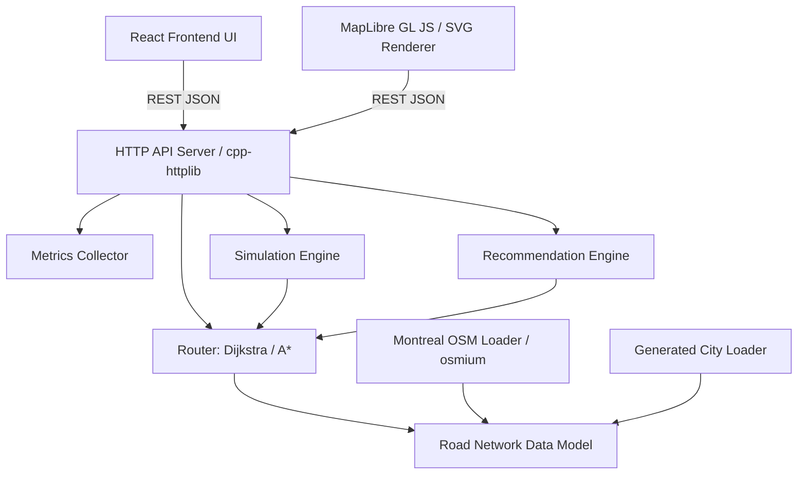

# Architecture Overview

## 1. High-Level Design

The Smart Mobility Simulator consists of a C++20 backend and a React/Vite frontend.

## 2. Core Backend Modules

- **RoadNetwork (`model/`)**: Central data structure storing Nodes and Roads.
- **Router (`routing/`)**: Graph traversal algorithms (Dijkstra, A*).
- **SimulationEngine (`simulation/`)**: Manages vehicle states, updates positions based on deltaTime, and triggers dynamic rerouting upon incidents.
- **RecommendationEngine (`recommendation/`)**: Uses user profiles (weights for time, distance, cost, traffic) to score and rank multiple route candidates.
- **MetricsCollector (`metrics/`)**: Centralized singleton tracking simulator statistics for the analytics dashboard.
- **HttpServer (`api/`)**: Translates HTTP JSON requests into internal backend calls. Handles error validation and consistent response formatting.

